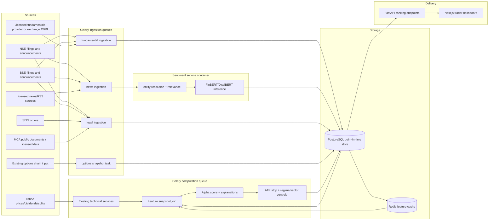

# Multi-Factor Alpha Generation and Ranking Module

Status: Proposed  
Target system: FastAPI + Next.js + Celery + Redis + PostgreSQL/TimescaleDB  
Primary horizons: weekly and monthly  
Universe: Nifty 500 plus explicitly configured BSE securities  
Document date: 2026-06-24

## 1. Executive decision

Build the module as a point-in-time feature store and precomputed ranking pipeline. Do not fetch fundamentals, news, legal records, or options data inside a ranking HTTP request.

The existing technical models remain responsible for technical feature calculation. New adapters independently ingest fundamental, news, and legal data into PostgreSQL, while Redis holds short-lived, read-optimized feature snapshots. A new `AlphaRankingService` joins the latest point-in-time feature snapshots, calculates deterministic factor scores, applies legal penalties and portfolio controls, persists the complete explanation, and publishes a compact API response.

This approach preserves:

- the existing `YahooFinanceAdapter` market-data path;
- `WeeklyPredictionService` and `MonthlyPredictionService` as orchestration entry points;
- current Redis cache and Pub/Sub behavior;
- current PostgreSQL prediction snapshots;
- existing Chartink, technical indicator, options, ATR, regime, and position-sizing code;
- reproducible rankings even when an upstream provider later revises its data.

The synchronous API must only read a completed ranking run. Generation remains available for operations, but it should enqueue a Celery job and return `202 Accepted` rather than holding an API thread while external data is fetched.

## 2. Current repository findings

The design is based on the current implementation, not an assumed greenfield architecture.

| Area | Current implementation | Design consequence |
|---|---|---|
| Technical weekly ranking | `nse_dashboard/services/weekly_predictions.py` | Retain the model and add an alpha-enrichment stage before filtering/ranking. |
| Technical monthly ranking | `nse_dashboard/services/monthly_predictions.py` and `trading/monthly.py` | Retain conservative monthly selection and use its score/features as Technical Alpha inputs. |
| Technical crossover | `trading/chartink.py` | Preserve exact completed-candle BUY/SELL semantics. |
| ATR and stop | `trading/indicators.py` and `trading/monthly.py` | Reuse `atr_14` and `proposed_stop`; do not create a second volatility implementation. |
| Sector exposure | `services/paper_portfolio.py` | Reuse the existing 20% sector cap policy and expose it in ranking controls. |
| Options analytics | `nse_dashboard/options/*` | Add a persisted per-underlying options feature snapshot; do not recalculate an entire chain during ranking. |
| Persistence | Direct `psycopg` repository, not SQLAlchemy | SQLAlchemy models below define the target schema and contracts. The production repository can initially continue using parameterized `psycopg` SQL. |
| API routes | `/api/v1/weekly-predictions` and `/api/v1/monthly-predictions` | Add requested `/api/rankings/weekly` and `/api/rankings/monthly` as aliases or v2 routes; retain v1 compatibility. |
| Frontend | Types are local to `dashboard-ui/app/page.tsx` | Extract ranking contracts into `dashboard-ui/types/rankings.ts`. |
| Symbol support | Main universe and `SignalService` require `.NS`; `indian_api.py` recognizes `.BO` but normalizes it back to `.NS` | BSE parity requires a canonical security master. It is not currently complete. |

## 3. Scope

### In scope

- Versioned quarterly fundamental snapshots.
- News and corporate-announcement ingestion every 15 minutes.
- Security-specific sentiment and relevance scoring.
- Legal/regulatory event ingestion and a deterministic risk quotient.
- Combined weekly/monthly scores with feature-level explanations.
- Point-in-time backtesting and purged walk-forward validation.
- ATR stop, market-regime exposure, and sector-cap annotations.
- PostgreSQL persistence, Redis read caches, API contracts, and dashboard filters.

### Out of scope for the first release

- Automated order routing.
- Intraday tick-level sentiment trading.
- Generative summaries used as numerical factors.
- Scraping sources without a documented right to access or stable contract.
- Treating model output as investment advice.

## 4. Architecture



### Runtime rule

No external network call is permitted on the path:

`GET ranking -> repository query -> response`

The ranking computation path may read PostgreSQL/Redis and existing batched Yahoo history. External-provider ingestion is a separate queue with its own retries, rate limits, and circuit breakers.

## 5. Canonical security identity and BSE parity

Ticker suffixes are provider aliases, not durable identities. Add a security master before adding new providers.

```text
security_id: internal UUID
isin: canonical cross-exchange identifier when available
issuer_id: canonical issuer UUID
exchange: NSE | BSE
exchange_symbol: RELIANCE
yahoo_symbol: RELIANCE.NS or 500325.BO
nse_symbol: RELIANCE or null
bse_scrip_code: 500325 or null
cin: MCA company identifier or null
sector_id: normalized sector
valid_from / valid_to: alias history
```

Resolution order:

1. ISIN exact match.
2. Exchange plus exchange symbol/scrip code.
3. CIN for issuer-level legal and financial records.
4. Curated alias table.
5. Fuzzy company-name matching only as a review queue; never automatically attach a legal penalty from fuzzy matching.

Required code change:

- Replace checks such as `symbol.endswith(".NS")` with `SecurityIdentifier.parse(symbol)`.
- Preserve the caller's exchange in API output.
- Do not convert `.BO` input to `.NS`.
- Build the Nifty 500 NSE universe as one configured universe; add BSE securities through a separate universe table rather than duplicating the issuer.

Initial BSE tests must include:

- `RELIANCE.NS` and its BSE listing resolving to the same issuer/ISIN;
- a BSE-only security;
- a changed company name;
- a symbol collision across exchanges;
- a record with missing CIN that must not receive MCA-derived flags.

## 6. Data-source strategy

Provider access and licensing must be verified before production use. Website endpoints that happen to return JSON are not automatically supported public APIs.

### 6.1 Fundamentals

Priority:

1. Licensed structured provider with Indian exchange coverage.
2. NSE/BSE financial results and shareholding disclosures, preferably XBRL or downloadable structured files.
3. Alpha Vantage as a fallback only after validating Indian symbol coverage and rate/cost limits.
4. A permitted open-source parser over downloaded issuer filings.

Do not assume Screener.in has a public production API. Use it only with an explicit commercial/API agreement or written permission. Do not build the production feature store around HTML selectors.

Yahoo may continue to supply splits, dividends, and market prices, but is not the authoritative accounting source.

Required fields per reporting period:

- TTM revenue and revenue growth;
- operating profit and operating margin;
- net profit and net margin;
- average equity and ROE;
- capital employed and ROCE;
- total debt, equity, and debt-to-equity;
- current assets, current liabilities, and current ratio;
- cash from operations, capital expenditure, and free cash flow;
- promoter holding and QoQ promoter holding change;
- basic/diluted EPS and P/E inputs;
- sector P/E snapshot;
- source publication date and system ingestion date.

Point-in-time rule:

`known_at = max(exchange_published_at, provider_published_at)`

A backtest may use a record only when `known_at <= prediction_as_of`. Never join by fiscal quarter alone.

Versioning:

- Insert immutable versions.
- Set `superseded_at` when a later restatement is observed.
- Hash the normalized source payload for idempotency.
- Keep raw source metadata/object location for audit.

Freshness:

- Scheduled quarterly full refresh.
- Daily incremental check during earnings seasons.
- A fundamental snapshot becomes stale after 150 days, but the latest known point-in-time record remains available with `freshness_status="STALE"`.

### 6.2 News and corporate announcements

Source priority:

1. NSE and BSE corporate announcements for issuer-originated events.
2. Licensed news feed for stable commercial use.
3. Google News RSS only as a low-cost discovery channel, subject to feed terms, deduplication, and link availability.
4. Moneycontrol only through a licensed API/contract; do not depend on undocumented scraping.

Ingestion sequence:

1. Fetch feed cursor since last successful item.
2. Normalize URL, title, publication time, source, language, and body/excerpt.
3. Deduplicate by canonical URL and SHA-256 of normalized title/body.
4. Resolve candidate issuers using ISIN/ticker mentions and alias dictionary.
5. Calculate entity relevance.
6. Run sentiment inference.
7. Persist article once and one `news_security_link` per linked security.
8. Refresh Redis aggregates for affected securities.

Sentiment:

```text
class probabilities = P(positive), P(neutral), P(negative)
raw_sentiment = P(positive) - P(negative)              # [-1, +1]
relevance = entity_confidence * event_materiality      # [0, 1]
source_quality = configured source prior               # [0, 1]
```

Event materiality is a lightweight classifier/rule layer for earnings, guidance, orders, capacity, management change, litigation, audit, default, pledge, and regulatory events.

For an article of age `a` days:

```text
decay(a) = 1                                      when a <= 5
decay(a) = exp(-ln(2) * (a - 5) / 2)             when a > 5
```

The two-day half-life after day five makes stale news rapidly irrelevant without abruptly deleting it.

Security aggregate:

```text
weighted_sentiment =
    sum(raw_sentiment_i * relevance_i * source_quality_i * decay_i)
    / sum(relevance_i * source_quality_i * decay_i)
```

Clamp the result to `[-1, 1]`. Store coverage count and denominator so a score based on one weak article is distinguishable from a broad news trend.

Model deployment:

- Start with a version-pinned FinBERT model.
- Build an Indian financial validation set containing exchange announcements, Indian English usage, abbreviations, and management commentary.
- Fine-tune only after the baseline has a measured failure taxonomy.
- Export to ONNX and use quantized CPU inference for the first release.
- Deploy a separate `sentiment-api` container only when traffic or GPU requirements justify it.
- The numerical factor must come from the versioned classifier output, not an unversioned LLM summary.

### 6.3 Legal and regulatory intelligence

Priority sources:

- SEBI orders and enforcement publications;
- NSE/BSE non-compliance, corporate filing, and disciplinary disclosures;
- issuer litigation and contingent-liability disclosures;
- MCA public documents or a licensed MCA data provider.

MCA access is operationally different from a normal anonymous REST feed. The implementation must support manual/licensed acquisition and document storage; it must not assume unrestricted bulk scraping.

Normalized event types:

```text
SEBI_PENALTY
SEBI_SHOW_CAUSE
EXCHANGE_NON_COMPLIANCE
TRADING_SUSPENSION
AUDITOR_QUALIFICATION
AUDITOR_RESIGNATION
DEFAULT_OR_RATING_DOWNGRADE
MATERIAL_LITIGATION
PROMOTER_PLEDGE_INCREASE
RELATED_PARTY_CONCERN
BOARD_MEETING
MANAGEMENT_RESIGNATION
OTHER_REGULATORY
```

Legal text extraction produces proposed labels, but high-impact flags must have deterministic evidence:

- source URL/document ID;
- event date and publication date;
- matched issuer identifier;
- extracted amount and authority where available;
- model/rule version;
- confidence;
- human-review status for ambiguous issuer resolution.

Risk quotient:

```text
event_points =
    severity_weight[event_type]
    * recency_multiplier
    * confidence
    * unresolved_multiplier

risk_quotient = min(100, sum(event_points over active lookback))
```

Suggested severity weights:

| Event | Points |
|---|---:|
| Trading suspension/default | 40 |
| SEBI final penalty/debarment | 35 |
| Auditor adverse/qualified opinion | 30 |
| Material litigation above configured net-worth threshold | 25 |
| Auditor resignation | 20 |
| Exchange non-compliance | 15 |
| Promoter pledge increase | 12 |
| Management resignation | 8 |
| Board meeting | 0 risk points; separate volatility flag | 0 |

Recency multipliers:

- 0-30 days: 1.00
- 31-90 days: 0.75
- 91-180 days: 0.50
- 181-365 days: 0.25
- resolved events: multiply by 0.25 unless the event is a final penalty

`board_meeting_volatility` is an event-risk indicator, not evidence of wrongdoing. It must not be presented as a legal breach.

## 7. Feature engineering

All raw features are stored separately from normalized scores. Normalization parameters are versioned by `feature_set_version`.

### 7.1 Fundamental Health score

Use winsorized sector-relative percentiles to avoid comparing banks, utilities, commodity businesses, and software companies on inappropriate absolute thresholds.

Default score:

| Component | Weight |
|---|---:|
| ROE percentile | 15 |
| ROCE percentile | 15 |
| Operating margin level and YoY change | 10 |
| Net margin level and YoY change | 10 |
| TTM revenue growth percentile | 10 |
| TTM net profit growth percentile | 10 |
| FCF margin and 6-month/TTM FCF growth | 10 |
| Debt-to-equity, sector-aware | 10 |
| Current ratio, sector-aware | 5 |
| Promoter holding QoQ change | 5 |

Total: 100.

Special handling:

- Banks/NBFCs: replace debt-to-equity and current ratio with capital adequacy/asset-quality fields when available. Until then, mark those fields not applicable and renormalize within the Fundamental factor.
- Negative equity: cap leverage component at zero and add a data-quality/risk flag.
- Negative base periods: growth rates use signed absolute denominator and are capped before percentile normalization.
- FCF: `cash_from_operations - abs(capex)`.

Grade:

| Score | Grade |
|---|---|
| 80-100 | A |
| 65-79.99 | B |
| 50-64.99 | C |
| 35-49.99 | D |
| below 35 | F |

### 7.2 Value Trap Filter

The requested rule is implemented as a transparent penalty:

```text
premium = company_pe / sector_pe - 1

value_trap_penalty =
    0                                          if premium <= 0.30
    min(15, 50 * (premium - 0.30))             otherwise
```

Apply the penalty to Fundamental Health after the base calculation.

Do not apply this rule when P/E is unavailable, negative, or sector P/E is non-positive. Emit `value_trap_filter="NOT_APPLICABLE"` rather than fabricating a neutral P/E.

This is technically a valuation-premium filter, not a complete value-trap test. A later version should combine high valuation with deteriorating FCF/margins before using the label “value trap” in the UI.

### 7.3 Momentum Quality

```text
price_momentum_score = percentile(sector, six_month_price_return)
fcf_growth_score = percentile(sector, six_month_or_latest_comparable_fcf_growth)

momentum_quality = 0.60 * price_momentum_score
                 + 0.40 * fcf_growth_score
```

Use it in two places:

- as 20 points inside the monthly Technical Alpha replacement/migration model; or
- initially, as an explanatory cross-factor diagnostic without changing the existing conservative technical score.

The safer first release is diagnostic-only. Promote it into the trained model only after walk-forward validation.

### 7.4 Sentiment score

Map aggregate sentiment to `[0, 100]`:

```text
sentiment_score = 50 * (weighted_sentiment + 1)
```

Confidence adjustment:

```text
coverage_confidence = min(1, effective_article_weight / target_weight)
adjusted_sentiment = 50 + (sentiment_score - 50) * coverage_confidence
```

Trend:

- Bullish: adjusted score >= 60
- Neutral: 40 < score < 60
- Bearish: score <= 40

### 7.5 Options/Smart Money score

Persist the existing analytics as a daily or intraday per-underlying snapshot:

- PCR level and change;
- call/put OI change;
- GEX regime and distance to gamma flip;
- implied-volatility percentile/skew;
- unusual activity;
- VWAP relationship;
- existing `Smart Money Score`.

The `Options Alpha` factor is the existing smart-money score normalized to `[0, 100]`. Keep every component in the feature breakdown.

For a security with no listed derivatives:

- set coverage to `NOT_APPLICABLE`;
- renormalize available positive factor weights;
- do not impute an options score of 50, because that grants unexplained points.

## 8. Ultimate Monthly Alpha Score

### 8.1 Full-coverage formula

Inputs are bounded to `[0, 100]`:

- `T`: Technical Alpha
- `O`: Options/Smart Money
- `F`: Fundamental Health after value-trap penalty
- `S`: News Sentiment
- `R`: Legal Risk Quotient, where 100 is worst

```text
technical_points   = 0.30 * T
options_points     = 0.20 * O
fundamental_points = 0.30 * F
sentiment_points   = 0.10 * S
legal_credit       = 10.0
legal_penalty      = 0.10 * R

combined_score = clamp(
    technical_points
  + options_points
  + fundamental_points
  + sentiment_points
  + legal_credit
  - legal_penalty,
  0,
  100
)
```

The 10-point legal credit makes a clean issuer capable of scoring 100 while retaining the requested maximum 10-point deduction. The API displays the credit and deduction separately; it must never describe “absence of detected events” as proof that no legal risk exists.

### 8.2 Missing-factor policy

Positive weights are renormalized over available factors. Legal penalty remains fixed.

```text
available = factors with acceptable freshness and coverage
effective_weight_i = base_weight_i / sum(base_weight_j for j in available)
positive_score = sum(effective_weight_i * factor_score_i)

combined_score = clamp(
    0.90 * positive_score + 10.0 - 0.10 * legal_risk,
    0,
    100
)
```

Requirements:

- expose `base_weights`, `effective_weights`, and missing reasons;
- reject a ranking when Technical or Fundamental is unavailable;
- require total available base weight >= 0.60;
- mark `coverage_status="PARTIAL"` when any optional factor is absent.

### 8.3 Ranking and tie-breaks

Primary sort:

1. `combined_score` descending;
2. `target_probability` descending;
3. `average_traded_value` descending;
4. symbol ascending for deterministic output.

Selection controls:

- max five per sector by default;
- optional global top 20;
- no new entry in `RISK_OFF`;
- portfolio maximum exposure from existing regime logic;
- maximum 20% sector exposure from existing paper-portfolio policy;
- minimum average traded value;
- legal exclusion threshold configurable, default `risk_quotient >= 70`;
- stale Fundamental data may be displayed but cannot receive grade A.

### 8.4 Trader-friendly contribution breakdown

Every pick stores both factor points and raw feature effects:

```json
{
  "factor_contributions": {
    "technical": 24.6,
    "options": 12.8,
    "fundamental": 25.2,
    "sentiment": 6.4,
    "legal_credit": 10.0,
    "legal_penalty": -3.5
  },
  "contribution_share_pct": {
    "technical": 35.7,
    "options": 18.6,
    "fundamental": 36.6,
    "sentiment": 9.1
  },
  "top_reasons": [
    "ROCE sector percentile contributed +4.2 points",
    "Six-month relative strength contributed +3.8 points",
    "Recent order-win sentiment contributed +1.4 points",
    "Open SEBI matter deducted 3.5 points"
  ]
}
```

Contribution shares use positive alpha points only. They do not hide the separate legal deduction.

## 9. Explainability model

Release 1 is a deterministic scorecard. Exact feature contributions are therefore calculated analytically and are preferable to SHAP.

Release 2 may train a tree ensemble to predict one-month excess return or probability of positive excess return. For that model:

- use TreeSHAP offline during the ranking task;
- store the base value, raw model output, and top feature SHAP values;
- map SHAP values into displayed score points with the model's calibrated score transform;
- version the model artifact, feature set, explainer, and background dataset;
- never compute KernelSHAP in an API request.

LIME is not required when exact scorecard contributions or TreeSHAP are available. Supporting two local explainers would create conflicting explanations without adding trading value.

## 10. Python service design

Proposed modules:

```text
nse_dashboard/
  domain/
    alpha.py
    fundamentals.py
    news.py
    legal.py
    securities.py
  infrastructure/
    fundamentals/
      base.py
      alpha_vantage.py
      exchange_filings.py
    news/
      base.py
      exchange_announcements.py
      rss.py
    legal/
      base.py
      sebi.py
      exchange_compliance.py
      mca.py
    alpha_repository.py
  services/
    fundamentals.py
    sentiment.py
    legal_risk.py
    alpha_ranking.py
  workers/
    fundamental_tasks.py
    news_tasks.py
    legal_tasks.py
    ranking_tasks.py
```

### 10.1 FundamentalService

```python
from __future__ import annotations

from dataclasses import dataclass
from datetime import datetime
from typing import Protocol, Sequence
from uuid import UUID


class FundamentalProvider(Protocol):
    name: str

    def fetch_periods(
        self,
        security: "SecurityIdentity",
        *,
        since: datetime | None,
    ) -> Sequence["RawFinancialPeriod"]: ...


class FundamentalRepository(Protocol):
    def upsert_versions(
        self,
        records: Sequence["FinancialSnapshotWrite"],
    ) -> int: ...

    def latest_known(
        self,
        security_ids: Sequence[UUID],
        *,
        known_at: datetime,
    ) -> dict[UUID, "FinancialSnapshot"]: ...


@dataclass(frozen=True, slots=True)
class FundamentalScoringPolicy:
    version: str = "fundamental-v1"
    stale_after_days: int = 150
    winsor_lower: float = 0.02
    winsor_upper: float = 0.98
    value_premium_trigger: float = 0.30
    maximum_value_penalty: float = 15.0


class FundamentalService:
    def __init__(
        self,
        *,
        providers: Sequence[FundamentalProvider],
        repository: FundamentalRepository,
        security_master: "SecurityMaster",
        policy: FundamentalScoringPolicy,
    ) -> None:
        self.providers = providers
        self.repository = repository
        self.security_master = security_master
        self.policy = policy

    def ingest_security(self, symbol: str) -> int:
        """Resolve one listing, fetch provider records, normalize, and version."""
        security = self.security_master.resolve(symbol)
        records: list[FinancialSnapshotWrite] = []
        for provider in self.providers:
            raw_periods = provider.fetch_periods(security, since=None)
            records.extend(
                normalize_financial_period(
                    security=security,
                    provider=provider.name,
                    raw=raw,
                )
                for raw in raw_periods
            )
        return self.repository.upsert_versions(records)

    def score_universe(
        self,
        security_ids: Sequence[UUID],
        *,
        as_of: datetime,
        sector_membership: dict[UUID, str],
    ) -> dict[UUID, "FundamentalScore"]:
        snapshots = self.repository.latest_known(
            security_ids,
            known_at=as_of,
        )
        return score_fundamentals_point_in_time(
            snapshots=snapshots,
            sectors=sector_membership,
            policy=self.policy,
        )
```

### 10.2 SentimentService

```python
from __future__ import annotations

from dataclasses import dataclass
from datetime import datetime
from typing import Protocol, Sequence
from uuid import UUID


class NewsProvider(Protocol):
    name: str

    def fetch_since(
        self,
        cursor: str | None,
        *,
        limit: int,
    ) -> tuple[Sequence["RawNewsItem"], str | None]: ...


class SentimentModel(Protocol):
    name: str
    version: str

    def predict(self, texts: Sequence[str]) -> Sequence["SentimentPrediction"]: ...


class EntityResolver(Protocol):
    version: str

    def link(self, item: "NormalizedNewsItem") -> Sequence["SecurityMention"]: ...


@dataclass(frozen=True, slots=True)
class SentimentPolicy:
    version: str = "sentiment-v1"
    grace_days: float = 5.0
    half_life_days_after_grace: float = 2.0
    aggregate_lookback_days: int = 30
    minimum_relevance: float = 0.35


class SentimentService:
    def __init__(
        self,
        *,
        providers: Sequence[NewsProvider],
        model: SentimentModel,
        resolver: EntityResolver,
        repository: "NewsRepository",
        cache: "TtlCache",
        policy: SentimentPolicy,
    ) -> None:
        self.providers = providers
        self.model = model
        self.resolver = resolver
        self.repository = repository
        self.cache = cache
        self.policy = policy

    def ingest_provider(self, provider_name: str) -> dict[str, int]:
        """Fetch incrementally, deduplicate, link issuers, infer, and persist."""
        provider = next(p for p in self.providers if p.name == provider_name)
        cursor = self.repository.get_cursor(provider.name)
        raw_items, next_cursor = provider.fetch_since(cursor, limit=500)
        items = deduplicate_and_normalize(raw_items)
        predictions = self.model.predict([item.model_text for item in items])
        inserted = self.repository.persist_scored_items(
            items=items,
            predictions=predictions,
            resolver=self.resolver,
            minimum_relevance=self.policy.minimum_relevance,
        )
        self.repository.set_cursor(provider.name, next_cursor)
        return {"fetched": len(raw_items), "inserted": inserted}

    def aggregate(
        self,
        security_ids: Sequence[UUID],
        *,
        as_of: datetime,
    ) -> dict[UUID, "SentimentAggregate"]:
        links = self.repository.links_for_window(
            security_ids,
            as_of=as_of,
            lookback_days=self.policy.aggregate_lookback_days,
        )
        result = aggregate_decayed_sentiment(links, as_of, self.policy)
        for security_id, value in result.items():
            self.cache.set(
                f"alpha:sentiment:{security_id}:{as_of.date().isoformat()}",
                value.to_dict(),
                ttl_seconds=24 * 60 * 60,
            )
        return result
```

### 10.3 AlphaRankingService integration

```python
class AlphaRankingService:
    def __init__(
        self,
        *,
        fundamentals: FundamentalService,
        sentiment: SentimentService,
        legal: LegalRiskService,
        options: OptionsFeatureRepository,
        rankings: AlphaRankingRepository,
        scoring_policy: AlphaScoringPolicy,
    ) -> None: ...

    def enrich_and_rank(
        self,
        *,
        horizon: Literal["weekly", "monthly"],
        as_of: datetime,
        technical_candidates: list[dict[str, Any]],
        limit_per_sector: int,
    ) -> AlphaRankingRun:
        """Join local snapshots, score, explain, constrain, persist, and cache."""
```

`WeeklyPredictionService.generate()` and `MonthlyPredictionService.generate()` should call this service after calculating technical candidates but before applying the final score threshold and sector rank.

## 11. SQLAlchemy target models

These are SQLAlchemy 2.x models. The repository currently uses `psycopg`; implementation may either add SQLAlchemy or translate these definitions into migrations and keep the existing repository style. Do not run two independent transaction layers in one unit of work.

```python
from __future__ import annotations

from datetime import date, datetime
from decimal import Decimal
from uuid import UUID, uuid4

from sqlalchemy import (
    Boolean,
    CheckConstraint,
    Date,
    DateTime,
    ForeignKey,
    Index,
    Integer,
    Numeric,
    String,
    Text,
    UniqueConstraint,
    func,
)
from sqlalchemy.dialects.postgresql import JSONB, UUID as PGUUID
from sqlalchemy.orm import DeclarativeBase, Mapped, mapped_column, relationship


class Base(DeclarativeBase):
    pass


class FinancialSnapshotModel(Base):
    __tablename__ = "financial_snapshots"
    __table_args__ = (
        UniqueConstraint(
            "security_id",
            "fiscal_period_end",
            "period_type",
            "source",
            "source_version",
            name="uq_financial_snapshot_version",
        ),
        CheckConstraint(
            "period_type IN ('QUARTERLY', 'ANNUAL', 'TTM')",
            name="ck_financial_period_type",
        ),
        Index(
            "ix_financial_point_in_time",
            "security_id",
            "known_at",
            "fiscal_period_end",
        ),
    )

    id: Mapped[UUID] = mapped_column(
        PGUUID(as_uuid=True), primary_key=True, default=uuid4
    )
    security_id: Mapped[UUID] = mapped_column(
        PGUUID(as_uuid=True),
        ForeignKey("securities.id", ondelete="CASCADE"),
        nullable=False,
    )
    fiscal_period_end: Mapped[date] = mapped_column(Date, nullable=False)
    period_type: Mapped[str] = mapped_column(String(16), nullable=False)
    currency: Mapped[str] = mapped_column(String(3), nullable=False, default="INR")
    source: Mapped[str] = mapped_column(String(64), nullable=False)
    source_version: Mapped[str] = mapped_column(String(128), nullable=False)
    source_url: Mapped[str | None] = mapped_column(Text)
    source_payload_hash: Mapped[str] = mapped_column(String(64), nullable=False)
    published_at: Mapped[datetime] = mapped_column(DateTime(timezone=True), nullable=False)
    known_at: Mapped[datetime] = mapped_column(DateTime(timezone=True), nullable=False)
    ingested_at: Mapped[datetime] = mapped_column(
        DateTime(timezone=True), nullable=False, server_default=func.now()
    )
    superseded_at: Mapped[datetime | None] = mapped_column(DateTime(timezone=True))

    revenue: Mapped[Decimal | None] = mapped_column(Numeric(22, 2))
    operating_profit: Mapped[Decimal | None] = mapped_column(Numeric(22, 2))
    net_profit: Mapped[Decimal | None] = mapped_column(Numeric(22, 2))
    total_assets: Mapped[Decimal | None] = mapped_column(Numeric(22, 2))
    total_debt: Mapped[Decimal | None] = mapped_column(Numeric(22, 2))
    total_equity: Mapped[Decimal | None] = mapped_column(Numeric(22, 2))
    current_assets: Mapped[Decimal | None] = mapped_column(Numeric(22, 2))
    current_liabilities: Mapped[Decimal | None] = mapped_column(Numeric(22, 2))
    cash_from_operations: Mapped[Decimal | None] = mapped_column(Numeric(22, 2))
    capital_expenditure: Mapped[Decimal | None] = mapped_column(Numeric(22, 2))
    free_cash_flow: Mapped[Decimal | None] = mapped_column(Numeric(22, 2))
    promoter_holding_pct: Mapped[Decimal | None] = mapped_column(Numeric(8, 4))

    ttm_revenue_growth_pct: Mapped[Decimal | None] = mapped_column(Numeric(10, 4))
    ttm_net_profit_growth_pct: Mapped[Decimal | None] = mapped_column(Numeric(10, 4))
    operating_margin_pct: Mapped[Decimal | None] = mapped_column(Numeric(10, 4))
    net_margin_pct: Mapped[Decimal | None] = mapped_column(Numeric(10, 4))
    roe_pct: Mapped[Decimal | None] = mapped_column(Numeric(10, 4))
    roce_pct: Mapped[Decimal | None] = mapped_column(Numeric(10, 4))
    debt_to_equity: Mapped[Decimal | None] = mapped_column(Numeric(12, 6))
    current_ratio: Mapped[Decimal | None] = mapped_column(Numeric(12, 6))
    fcf_growth_pct: Mapped[Decimal | None] = mapped_column(Numeric(10, 4))
    promoter_holding_change_qoq_pct: Mapped[Decimal | None] = mapped_column(
        Numeric(10, 4)
    )
    pe_ratio: Mapped[Decimal | None] = mapped_column(Numeric(12, 4))
    sector_pe_ratio: Mapped[Decimal | None] = mapped_column(Numeric(12, 4))

    raw_payload: Mapped[dict] = mapped_column(JSONB, nullable=False, default=dict)
    quality_flags: Mapped[list] = mapped_column(JSONB, nullable=False, default=list)


class NewsArticleModel(Base):
    __tablename__ = "news_articles"
    __table_args__ = (
        UniqueConstraint("canonical_url_hash", name="uq_news_canonical_url_hash"),
        UniqueConstraint("content_hash", name="uq_news_content_hash"),
        Index("ix_news_published_at", "published_at"),
    )

    id: Mapped[UUID] = mapped_column(
        PGUUID(as_uuid=True), primary_key=True, default=uuid4
    )
    provider: Mapped[str] = mapped_column(String(64), nullable=False)
    provider_item_id: Mapped[str | None] = mapped_column(String(256))
    source_name: Mapped[str] = mapped_column(String(128), nullable=False)
    source_quality: Mapped[Decimal] = mapped_column(
        Numeric(5, 4), nullable=False, default=Decimal("0.5")
    )
    canonical_url: Mapped[str] = mapped_column(Text, nullable=False)
    canonical_url_hash: Mapped[str] = mapped_column(String(64), nullable=False)
    content_hash: Mapped[str] = mapped_column(String(64), nullable=False)
    title: Mapped[str] = mapped_column(Text, nullable=False)
    summary: Mapped[str | None] = mapped_column(Text)
    body_text: Mapped[str | None] = mapped_column(Text)
    language: Mapped[str] = mapped_column(String(16), nullable=False, default="en")
    published_at: Mapped[datetime] = mapped_column(DateTime(timezone=True), nullable=False)
    fetched_at: Mapped[datetime] = mapped_column(
        DateTime(timezone=True), nullable=False, server_default=func.now()
    )
    model_name: Mapped[str] = mapped_column(String(128), nullable=False)
    model_version: Mapped[str] = mapped_column(String(128), nullable=False)
    positive_probability: Mapped[Decimal] = mapped_column(Numeric(7, 6), nullable=False)
    neutral_probability: Mapped[Decimal] = mapped_column(Numeric(7, 6), nullable=False)
    negative_probability: Mapped[Decimal] = mapped_column(Numeric(7, 6), nullable=False)
    raw_sentiment: Mapped[Decimal] = mapped_column(Numeric(8, 7), nullable=False)
    event_type: Mapped[str | None] = mapped_column(String(64))
    model_metadata: Mapped[dict] = mapped_column(JSONB, nullable=False, default=dict)

    security_links: Mapped[list["NewsSecurityLinkModel"]] = relationship(
        back_populates="article",
        cascade="all, delete-orphan",
    )


class NewsSecurityLinkModel(Base):
    __tablename__ = "news_security_links"
    __table_args__ = (
        UniqueConstraint("article_id", "security_id", name="uq_news_security_link"),
        CheckConstraint("relevance >= 0 AND relevance <= 1", name="ck_news_relevance"),
        Index("ix_news_security_time", "security_id", "article_id"),
    )

    id: Mapped[UUID] = mapped_column(
        PGUUID(as_uuid=True), primary_key=True, default=uuid4
    )
    article_id: Mapped[UUID] = mapped_column(
        PGUUID(as_uuid=True),
        ForeignKey("news_articles.id", ondelete="CASCADE"),
        nullable=False,
    )
    security_id: Mapped[UUID] = mapped_column(
        PGUUID(as_uuid=True),
        ForeignKey("securities.id", ondelete="CASCADE"),
        nullable=False,
    )
    relevance: Mapped[Decimal] = mapped_column(Numeric(7, 6), nullable=False)
    entity_confidence: Mapped[Decimal] = mapped_column(Numeric(7, 6), nullable=False)
    event_materiality: Mapped[Decimal] = mapped_column(Numeric(7, 6), nullable=False)
    resolver_version: Mapped[str] = mapped_column(String(128), nullable=False)
    matched_aliases: Mapped[list] = mapped_column(JSONB, nullable=False, default=list)
    is_primary_subject: Mapped[bool] = mapped_column(Boolean, nullable=False, default=False)

    article: Mapped[NewsArticleModel] = relationship(back_populates="security_links")
```

## 12. Pydantic API/domain models

These use Pydantic v2 syntax, which should be made an explicit dependency even though FastAPI already depends on Pydantic.

```python
from datetime import date, datetime
from typing import Literal
from uuid import UUID

from pydantic import BaseModel, ConfigDict, Field


class FinancialSnapshotRead(BaseModel):
    model_config = ConfigDict(from_attributes=True)

    id: UUID
    security_id: UUID
    fiscal_period_end: date
    period_type: Literal["QUARTERLY", "ANNUAL", "TTM"]
    currency: str = Field(pattern=r"^[A-Z]{3}$")
    source: str
    source_version: str
    published_at: datetime
    known_at: datetime
    ingested_at: datetime
    superseded_at: datetime | None = None

    ttm_revenue_growth_pct: float | None = None
    ttm_net_profit_growth_pct: float | None = None
    operating_margin_pct: float | None = None
    net_margin_pct: float | None = None
    roe_pct: float | None = None
    roce_pct: float | None = None
    debt_to_equity: float | None = None
    current_ratio: float | None = None
    free_cash_flow: float | None = None
    fcf_growth_pct: float | None = None
    promoter_holding_pct: float | None = Field(default=None, ge=0, le=100)
    promoter_holding_change_qoq_pct: float | None = None
    pe_ratio: float | None = None
    sector_pe_ratio: float | None = None
    quality_flags: list[str] = Field(default_factory=list)


class NewsSecurityScore(BaseModel):
    model_config = ConfigDict(from_attributes=True)

    article_id: UUID
    security_id: UUID
    title: str
    source_name: str
    canonical_url: str
    published_at: datetime
    raw_sentiment: float = Field(ge=-1, le=1)
    relevance: float = Field(ge=0, le=1)
    source_quality: float = Field(ge=0, le=1)
    event_type: str | None = None
    model_name: str
    model_version: str


class FactorContribution(BaseModel):
    raw_score: float = Field(ge=0, le=100)
    base_weight: float = Field(ge=0, le=1)
    effective_weight: float = Field(ge=0, le=1)
    points: float
    coverage: Literal["FULL", "PARTIAL", "NOT_APPLICABLE", "STALE", "MISSING"]


class RankingFeatureBreakdown(BaseModel):
    technical: dict[str, float | str | bool | None]
    options: dict[str, float | str | bool | None]
    fundamentals: dict[str, float | str | bool | None]
    sentiment: dict[str, float | str | bool | None]
    legal: dict[str, float | str | bool | None]


class RankingPick(BaseModel):
    symbol: str
    exchange: Literal["NSE", "BSE"]
    name: str
    sector: str
    overall_rank: int = Field(ge=1)
    sector_rank: int = Field(ge=1)
    price: float = Field(gt=0)
    combined_score: float = Field(ge=0, le=100)
    fundamental_grade: Literal["A", "B", "C", "D", "F"]
    sentiment_trend: Literal["Bullish", "Neutral", "Bearish"]
    legal_risk_flag: Literal["High", "Medium", "Low", "Unknown"]
    legal_risk_quotient: float | None = Field(default=None, ge=0, le=100)
    target_probability: float = Field(ge=0, le=1)
    predicted_return_pct: float
    atr_stop_loss: float | None = None
    sector_exposure_cap_pct: float = Field(ge=0, le=100)
    entry_allowed: bool
    coverage_status: Literal["FULL", "PARTIAL"]
    factor_contributions: dict[str, FactorContribution]
    feature_breakdown: RankingFeatureBreakdown
    feature_contributions: dict[str, float]
    top_reasons: list[str]
    disclaimer: str


class RankingResponse(BaseModel):
    generated_at: datetime
    market_date: date
    horizon: Literal["weekly", "monthly"]
    model_name: str
    model_version: str
    feature_set_version: str
    ranking_run_id: UUID
    universe_size: int
    eligible_stocks: int
    predictions_count: int
    filters: dict[str, object]
    base_weights: dict[str, float]
    picks: list[RankingPick]
    sectors: list[dict[str, object]]
    disclaimer: str
```

## 13. Persistence changes

Add migrations after `005_conservative_monthly_system.sql`:

```text
006_security_master.sql
007_financial_feature_store.sql
008_news_sentiment.sql
009_legal_events.sql
010_options_feature_snapshots.sql
011_alpha_ranking_runs.sql
```

Key alpha tables:

```text
alpha_ranking_runs
  id UUID PK
  generated_at TIMESTAMPTZ
  market_date DATE
  horizon TEXT
  horizon_months SMALLINT NULL
  model_name/model_version/feature_set_version
  weights JSONB
  filters JSONB
  source_freshness JSONB
  validation_artifact_id UUID NULL
  UNIQUE(market_date, horizon, model_version, feature_set_version)

alpha_rankings
  run_id UUID FK
  security_id UUID FK
  symbol TEXT
  sector TEXT
  overall_rank SMALLINT
  sector_rank SMALLINT
  combined_score DOUBLE PRECISION
  fundamental_grade CHAR(1)
  sentiment_trend TEXT
  legal_risk_flag TEXT
  legal_risk_quotient DOUBLE PRECISION
  atr_stop_loss DOUBLE PRECISION NULL
  payload JSONB
  PRIMARY KEY(run_id, security_id)
```

Continue storing a complete JSONB payload to preserve the current snapshot pattern. Promote only fields used in filters/sorts to typed columns.

Recommended indexes:

- `alpha_ranking_runs(horizon, market_date DESC, generated_at DESC)`
- `alpha_rankings(run_id, overall_rank)`
- `alpha_rankings(run_id, sector, sector_rank)`
- `alpha_rankings(run_id, fundamental_grade, legal_risk_flag)`
- GIN only on JSONB paths proven by query telemetry; do not index the complete payload by default.

## 14. Combined scoring pseudocode

```python
def score_candidate(candidate, features, policy):
    assert candidate.technical_score is not None
    assert features.fundamental_score is not None

    raw_scores = {
        "technical": clamp(candidate.technical_score, 0, 100),
        "options": optional_clamp(features.options_score, 0, 100),
        "fundamental": clamp(features.fundamental_score, 0, 100),
        "sentiment": optional_clamp(features.sentiment_score, 0, 100),
    }

    base_weights = {
        "technical": 0.30,
        "options": 0.20,
        "fundamental": 0.30,
        "sentiment": 0.10,
    }

    available = {
        name
        for name, score in raw_scores.items()
        if score is not None and features.coverage[name].is_usable
    }
    if "technical" not in available or "fundamental" not in available:
        return Rejected("required factor missing")

    available_weight = sum(base_weights[name] for name in available)
    if available_weight < 0.60:
        return Rejected("insufficient factor coverage")

    effective_weights = {
        name: base_weights[name] / available_weight
        for name in available
    }
    positive_score = sum(
        effective_weights[name] * raw_scores[name]
        for name in available
    )

    legal_risk = clamp(features.legal_risk_quotient or 0, 0, 100)
    legal_unknown = features.legal_risk_quotient is None
    legal_credit = 10.0 if not legal_unknown else policy.unknown_legal_credit
    legal_penalty = 0.10 * legal_risk

    combined = clamp(
        0.90 * positive_score + legal_credit - legal_penalty,
        0,
        100,
    )

    # Convert effective positive factor scores into final 90-point contribution.
    factor_points = {
        name: 0.90 * effective_weights[name] * raw_scores[name]
        for name in available
    }

    feature_contributions = {
        **candidate.technical_feature_points,
        **features.fundamental_feature_points,
        **features.options_feature_points,
        **features.sentiment_feature_points,
        **features.legal_feature_deductions,
    }

    stop = candidate.entry.proposed_stop  # existing ATR/SuperTrend implementation
    entry_allowed = (
        candidate.regime.state != "RISK_OFF"
        and legal_risk < policy.legal_exclusion_threshold
        and not features.has_trading_suspension
    )

    return RankedCandidate(
        combined_score=round(combined, 2),
        factor_points=factor_points,
        legal_credit=legal_credit,
        legal_penalty=-legal_penalty,
        feature_contributions=feature_contributions,
        top_reasons=top_absolute_contributions(feature_contributions, limit=5),
        atr_stop_loss=stop,
        entry_allowed=entry_allowed,
    )
```

Unknown legal coverage must be displayed as `Unknown`, not `Low`. `unknown_legal_credit` should default to zero until source coverage is operationally verified.

## 15. API design

### Routes

New:

```text
GET  /api/rankings/weekly
GET  /api/rankings/monthly?horizon_months=1
POST /api/rankings/weekly/generate
POST /api/rankings/monthly/generate?horizon_months=1
GET  /api/rankings/{horizon}/{symbol}/history
```

Compatibility:

- Existing `/api/v1/weekly-predictions` and `/api/v1/monthly-predictions` continue returning their current shape during the migration.
- Add `schema_version="2.0"` and enriched fields to v2 routes.
- Generation POST enqueues Celery and returns a task/run ID. A separate status endpoint or latest GET returns the completed run.

Filters:

```text
fundamental_grade=A,B
exclude_legal_risks=true
minimum_combined_score=65
sector=Information Technology
limit=20
limit_per_sector=5
coverage=FULL
```

### Updated response example

```json
{
  "schema_version": "2.0",
  "generated_at": "2026-06-24T10:30:00Z",
  "market_date": "2026-06-24",
  "horizon": "monthly",
  "horizon_months": 1,
  "ranking_run_id": "c968d3bc-92ec-4dc5-8981-70bad5a1ce73",
  "model": {
    "name": "multi_factor_monthly_alpha",
    "version": "1.0.0",
    "feature_set_version": "alpha-features-v1"
  },
  "base_weights": {
    "technical": 0.30,
    "options": 0.20,
    "fundamental": 0.30,
    "sentiment": 0.10,
    "legal_max_deduction": 0.10
  },
  "universe_size": 500,
  "eligible_stocks": 412,
  "predictions_count": 20,
  "filters": {
    "fundamental_grade": ["A", "B"],
    "exclude_legal_risks": true,
    "limit": 20
  },
  "picks": [
    {
      "symbol": "EXAMPLE.NS",
      "exchange": "NSE",
      "name": "EXAMPLE",
      "sector": "Industrials",
      "overall_rank": 1,
      "sector_rank": 1,
      "price": 1240.5,
      "combined_score": 75.5,
      "fundamental_grade": "A",
      "sentiment_trend": "Bullish",
      "legal_risk_flag": "Medium",
      "legal_risk_quotient": 35.0,
      "predicted_return_pct": 5.8,
      "target_probability": 0.71,
      "atr_stop_loss": 1168.2,
      "sector_exposure_cap_pct": 20.0,
      "entry_allowed": true,
      "coverage_status": "FULL",
      "factor_contributions": {
        "technical": {
          "raw_score": 82.0,
          "base_weight": 0.3,
          "effective_weight": 0.333333,
          "points": 24.6,
          "coverage": "FULL"
        },
        "options": {
          "raw_score": 64.0,
          "base_weight": 0.2,
          "effective_weight": 0.222222,
          "points": 12.8,
          "coverage": "FULL"
        },
        "fundamental": {
          "raw_score": 84.0,
          "base_weight": 0.3,
          "effective_weight": 0.333333,
          "points": 25.2,
          "coverage": "FULL"
        },
        "sentiment": {
          "raw_score": 64.0,
          "base_weight": 0.1,
          "effective_weight": 0.111111,
          "points": 6.4,
          "coverage": "FULL"
        }
      },
      "legal_credit": 10.0,
      "legal_penalty": -3.5,
      "feature_breakdown": {
        "technical": {
          "score": 82.0,
          "momentum_6m_pct": 18.4,
          "relative_strength_6m_pct": 9.1,
          "rsi_14": 61.2,
          "atr_14": 36.15
        },
        "options": {
          "score": 64.0,
          "pcr": 1.18,
          "gex_regime": "POSITIVE",
          "smart_money_score": 64.0
        },
        "fundamentals": {
          "score": 84.0,
          "roe_pct": 21.4,
          "roce_pct": 24.8,
          "debt_to_equity": 0.31,
          "current_ratio": 1.82,
          "ttm_revenue_growth_pct": 17.9,
          "fcf_growth_pct": 22.1,
          "promoter_holding_pct": 53.2,
          "promoter_holding_change_qoq_pct": 0.2,
          "pe_ratio": 28.0,
          "sector_pe_ratio": 26.5,
          "value_trap_penalty": 0.0,
          "known_at": "2026-05-18T12:10:00Z"
        },
        "sentiment": {
          "score": 64.0,
          "composite_score": 0.28,
          "effective_article_count": 7.4,
          "model_version": "finbert-india-1.0.0"
        },
        "legal": {
          "risk_quotient": 35.0,
          "has_sebi_penalty": true,
          "auditor_qualification": false,
          "board_meeting_volatility": false,
          "latest_event_at": "2026-06-10T08:30:00Z"
        }
      },
      "feature_contributions": {
        "roe_sector_percentile": 4.2,
        "roce_sector_percentile": 4.5,
        "six_month_relative_strength": 3.8,
        "news_sentiment": 1.4,
        "sebi_penalty": -3.5
      },
      "top_reasons": [
        "ROCE contributed +4.5 points",
        "ROE contributed +4.2 points",
        "Six-month relative strength contributed +3.8 points",
        "SEBI event deducted 3.5 points"
      ],
      "disclaimer": "Research signal only; not investment advice."
    }
  ],
  "disclaimer": "Rankings are quantitative research signals, not investment advice or a guarantee of returns."
}
```

The example symbol is intentionally fictional.

## 16. Frontend design

Extract shared types and add:

```text
dashboard-ui/types/rankings.ts
dashboard-ui/components/rankings/RankingFilters.tsx
dashboard-ui/components/rankings/FactorContributionBar.tsx
dashboard-ui/components/rankings/FeatureBreakdownDrawer.tsx
dashboard-ui/components/rankings/LegalRiskBadge.tsx
```

Filters:

- Fundamental grade multiselect.
- “Exclude High Legal Risk” checkbox.
- Optional “Full data coverage only” checkbox.
- Sector and minimum score.

Ranking card:

- rank, symbol, exchange, price;
- combined score;
- four positive factor contribution bars;
- legal deduction in red;
- grade, sentiment trend, legal risk badge;
- ATR stop and entry eligibility;
- top three reasons;
- expandable exact feature breakdown and source timestamps.

Do not label an issuer “safe”. Use `Low detected risk`, `Medium detected risk`, `High detected risk`, or `Coverage unknown`.

## 17. Celery tasks and schedules

New queues:

```text
fundamentals
news-ingestion
sentiment
legal
alpha-ranking
```

Recommended tasks:

| Task | Queue | Schedule | TTL/idempotency |
|---|---|---|---|
| `workers.refresh_fundamental_incremental` | fundamentals | daily 06:30 IST | key by provider/security/date |
| `workers.refresh_fundamental_full` | fundamentals | Sunday 07:00 IST, plus quarter-end run | key by provider/quarter |
| `workers.fetch_exchange_announcements` | news-ingestion | every 15 min | provider cursor + item hash |
| `workers.fetch_news_feeds` | news-ingestion | every 15 min | provider cursor + URL/content hash |
| `workers.score_news_batch` | sentiment | chained after ingestion | article/model version |
| `workers.refresh_legal_events` | legal | every 6 hours | source document ID/hash |
| `workers.refresh_options_features` | alpha-ranking | after market snapshots / configured intraday | underlying/as-of |
| `workers.generate_weekly_alpha` | alpha-ranking | Friday after completed data, 16:15 IST | market date/model version |
| `workers.generate_monthly_alpha` | alpha-ranking | first trading session after month-end, 16:30 IST | month/model version |
| `workers.refresh_latest_alpha_cache` | alpha-ranking | after successful ranking | run ID |

Do not schedule monthly generation with `day_of_month="1"` alone. The first calendar day may be a weekend/holiday and may not have a completed monthly market bar. Trigger from the trading calendar or run daily on days 1-5 and claim an idempotency key for the latest completed month.

Failure policy:

- provider retries use exponential backoff with jitter;
- HTTP 4xx authentication/quota errors go to a dead-letter/operations alert, not infinite retry;
- NLP failure leaves the article persisted as `UNSCORED`;
- ranking uses the most recent usable snapshot and exposes staleness;
- a failed new ranking never deletes the previous completed run.

## 18. Latency and capacity

Target for a 500-security universe:

| Stage | Budget |
|---|---:|
| Load latest local feature snapshots | 1.5 s |
| Existing batched technical computation | 8.0 s |
| Vectorized normalization/scoring | 1.0 s |
| Constraints, explanations, ranking | 1.0 s |
| Persist run and Redis cache | 2.0 s |
| Contingency | 1.5 s |
| Total worker target | <= 15 s |

HTTP read target:

- p95 < 300 ms from PostgreSQL;
- p95 < 100 ms from Redis;
- payload gzip enabled;
- no SHAP, NLP, scraping, or provider fetch during GET.

If the existing technical calculation cannot remain under the budget, precompute technical feature snapshots as well. API latency is never allowed to depend on the full 500-stock run.

## 19. Walk-forward validation

### 19.1 Dataset construction

Observation:

`(security_id, prediction_as_of, feature_set_version)`

Label:

- one-month forward total return;
- one-month excess return over sector and benchmark;
- optional binary label `excess_return > transaction_cost_buffer`.

Point-in-time joins:

- prices only through `prediction_as_of`;
- financial record `known_at <= prediction_as_of`;
- news/legal publication time `<= prediction_as_of`;
- options snapshot `as_of <= prediction_as_of`;
- historical constituent membership, not today's universe projected backward.

### 19.2 Rolling procedure

For each validation month `M`:

1. Training features span the 12 months ending before `M`.
2. Validation is month `M`.
3. Purge training observations whose forward-return label overlaps `M`.
4. Apply a five-trading-session embargo after the training/validation boundary for features with delayed publication concerns.
5. Fit normalization on training data only.
6. Fit/calibrate model on training data only.
7. Score and rank the validation universe.
8. Record results before advancing one month.

For a 21-session label, purge at least the final 21 trading sessions whose labels overlap the validation month. The exact purge is event-time based, not a fixed row count when calendars differ.

### 19.3 Acceptance metrics

Evaluate:

- monthly Spearman rank IC and IC information ratio;
- top-decile and top-20 excess return;
- long-top-decile minus universe return;
- hit rate;
- turnover and return after estimated costs;
- annualized Sharpe/Sortino;
- maximum drawdown;
- sector concentration;
- performance by market regime;
- calibration/Brier score for target probability;
- coverage and stale-data rates;
- sensitivity when each factor is removed.

Promotion gates must be defined before the final backtest. Minimum suggested gates:

- positive median monthly rank IC;
- positive after-cost top-20 excess return;
- no single sector responsible for more than 35% of gross alpha;
- acceptable drawdown relative to the existing technical baseline;
- no degradation concentrated in `.BO` or non-F&O coverage groups.

### 19.4 Backtest artifacts

Persist:

- source data cut IDs;
- universe membership version;
- model/feature versions;
- fold boundaries and purge/embargo intervals;
- predictions and explanations;
- cost assumptions;
- metrics and plots;
- code commit identifier when Git metadata is available.

## 20. Test strategy

Unit:

- financial calculations including negative denominators and restatements;
- sector percentile fitting without validation leakage;
- value-premium penalty boundaries;
- news decay at 5, 7, and 30 days;
- entity resolution with NSE/BSE aliases;
- legal risk severity/recency/resolution;
- missing-factor weight renormalization;
- contribution sum equals combined score;
- legal unknown is not rendered Low;
- ATR stop comes from existing indicator output.

Repository:

- point-in-time `known_at` query;
- immutable financial versions;
- article deduplication;
- ranking run idempotency;
- latest completed run survives failed generation;
- JSONB serialization with Decimal/datetime values.

Integration:

- Celery chain from announcement fetch to sentiment cache;
- 500-security ranking with all upstream calls mocked;
- API filters for grade and legal risk;
- `.NS` and `.BO` parity;
- v1 endpoints remain compatible.

Backtest:

- synthetic late financial filing cannot appear before `known_at`;
- delisted/renamed security remains in historical universe;
- label overlap is purged;
- normalization is trained per fold.

Performance:

- worker run under 15 seconds with local snapshots;
- GET endpoint p95 target;
- sentiment batch throughput;
- Redis payload size and PostgreSQL query plan.

## 21. Four-week implementation roadmap

### Week 1: identity, fundamentals, and legal foundation

1. Add security master and canonical symbol resolver.
2. Add `.NS`/`.BO` unit tests before changing service validation.
3. Add financial/legal migrations and repository protocols.
4. Implement one licensed/approved fundamental adapter plus exchange filing fallback.
5. Implement SEBI/NSE/BSE legal adapters; leave MCA behind a provider interface until access is settled.
6. Add independent Celery tasks and idempotency keys.
7. Persist raw source metadata and immutable versions.
8. Do not integrate scores into production rankings yet.

Exit criteria:

- point-in-time financial snapshot for test issuers;
- legal events with auditable source evidence;
- `.BO` records remain `.BO`;
- no change to current ranking output.

### Week 2: news and sentiment

1. Add news/article/link schema and deduplication.
2. Implement exchange announcements and one approved news/RSS source.
3. Build entity resolver using security master aliases.
4. Deploy version-pinned FinBERT baseline, initially CPU/ONNX.
5. Create Indian financial validation dataset and baseline metrics.
6. Run 15-minute ingestion and Redis aggregation.
7. Add observability: fetch lag, unscored count, model latency, entity-link confidence.

Exit criteria:

- repeated articles deduplicate;
- issuer links are reviewable;
- sentiment aggregate is reproducible for a specified `as_of`;
- stale news decay is tested.

### Week 3: scoring and weekly shadow integration

1. Add options feature snapshot repository.
2. Implement deterministic factor scorecard and explanations.
3. Add `AlphaRankingService`.
4. Integrate with `WeeklyPredictionService` behind `MULTI_FACTOR_ALPHA_ENABLED=false`.
5. Run shadow rankings beside the existing weekly ranking.
6. Compare coverage, rank changes, latency, and contribution sums.
7. Add ATR stop and sector exposure annotations.

Exit criteria:

- full 500-security local-data run within 15 seconds or moved entirely to precomputation;
- every ranked pick has auditable contribution sums;
- existing endpoint behavior is unchanged while the flag is off.

### Week 4: monthly integration, API, frontend, and validation

1. Integrate monthly service behind the same feature flag.
2. Add alpha ranking run/pick migrations and repository methods.
3. Add `/api/rankings/weekly` and `/api/rankings/monthly`.
4. Add TypeScript contracts, filters, contribution bars, and risk badges.
5. Implement rolling 12-month/one-month purged validation.
6. Publish a model card and validation artifact.
7. Enable in staging, then production read-only/shadow mode.

Exit criteria:

- v1 contracts remain green;
- requested API keys and filters are present;
- point-in-time backtest passes leakage tests;
- production activation requires an explicit feature flag and rollback plan.

## 22. Rollout and operations

Feature flags:

```text
MULTI_FACTOR_ALPHA_ENABLED
FUNDAMENTAL_PROVIDER_ENABLED
NEWS_SENTIMENT_ENABLED
LEGAL_RISK_ENABLED
ALPHA_USE_TRAINED_MODEL
ALPHA_EXCLUDE_HIGH_LEGAL_RISK
```

Rollout:

1. Ingestion only.
2. Shadow feature calculation.
3. Shadow ranking persisted but not shown.
4. Dashboard opt-in tab.
5. Default ranking after validation.

Rollback:

- turn off `MULTI_FACTOR_ALPHA_ENABLED`;
- v1 weekly/monthly services continue using existing technical logic;
- retain ingested data for audit;
- never delete a completed ranking run during rollback.

Metrics:

- provider success/error/rate-limit counts;
- latest data age by source;
- unresolved entity links;
- sentiment inference latency;
- legal coverage unknown rate;
- ranking duration;
- ranking coverage by factor;
- API cache hit rate;
- score distribution drift;
- top-20 turnover and sector concentration.

## 23. Security, legal, and compliance controls

- Store provider credentials in secrets, never Redis payloads or ranking JSON.
- Sanitize and treat fetched documents as untrusted data.
- Do not execute document macros, embedded scripts, or links.
- Retain source attribution and licensing metadata.
- Respect robots.txt, provider terms, rate limits, and redistribution restrictions.
- Use access-controlled object storage for purchased MCA/legal documents.
- Separate “detected legal/regulatory events” from legal conclusions.
- Add this disclaimer to all ranking responses and views:

> Quantitative research signal only. It is not investment advice, a recommendation, or a guarantee of returns. Regulatory and legal data may be incomplete or delayed.

## 24. Cost-efficient deployment

Recommended initial stack:

- Exchange filings/announcements as primary first-party sources.
- Yahoo only for existing market data, splits, and dividends.
- CPU-quantized FinBERT batch inference.
- PostgreSQL JSONB plus typed filter columns; no new feature-store product.
- Redis only for latest aggregates and ranking responses.
- Object storage only for source documents that must be retained.
- Licensed fundamentals/news provider only where exchange data is incomplete or parsing cost exceeds subscription cost.

Avoid:

- Bloomberg/Reuters dependency for the first release;
- GPU service before CPU throughput is measured;
- scraping multiple unstable websites;
- online SHAP;
- per-request joins across raw article/legal tables.

## 25. External references

- NSE corporate filings and announcements: https://www.nseindia.com/companies-listing/corporate-filings-announcements
- Alpha Vantage fundamental API documentation: https://www.alphavantage.co/documentation/
- FinBERT paper: https://arxiv.org/abs/1908.10063
- DistilBERT paper: https://arxiv.org/abs/1910.01108
- SHAP paper: https://arxiv.org/abs/1705.07874

These references confirm available concepts/endpoints, not production licensing rights. Provider contracts and current terms must be reviewed before implementation.
